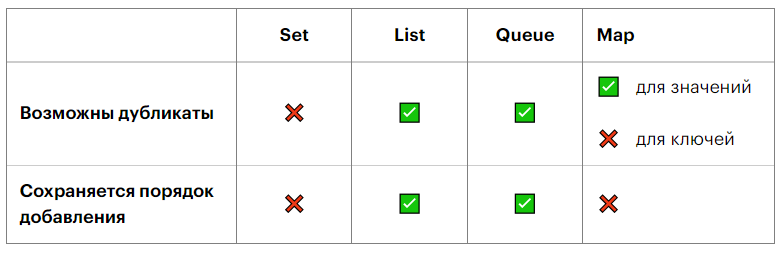
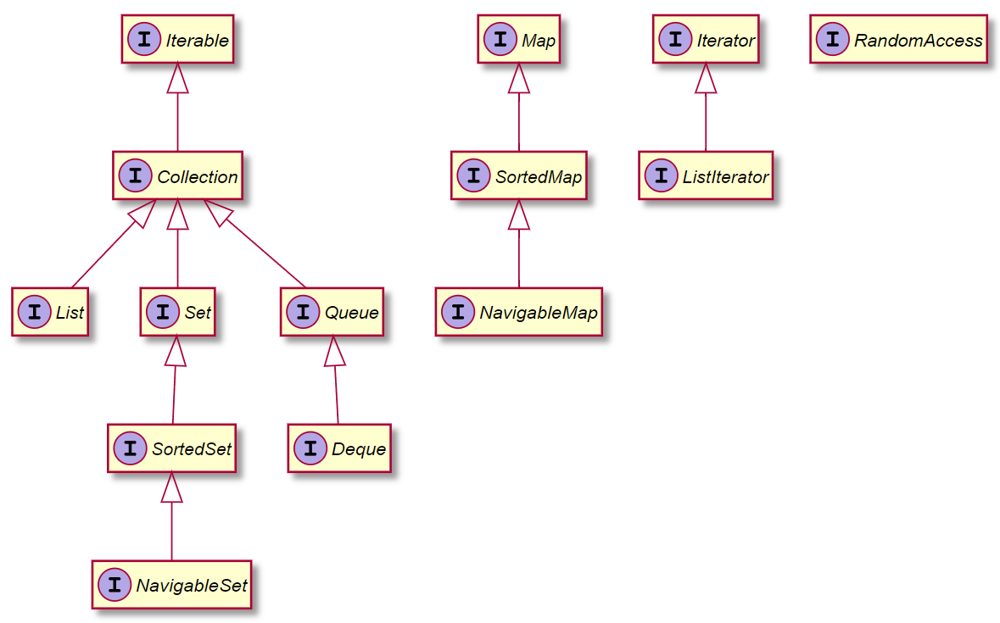
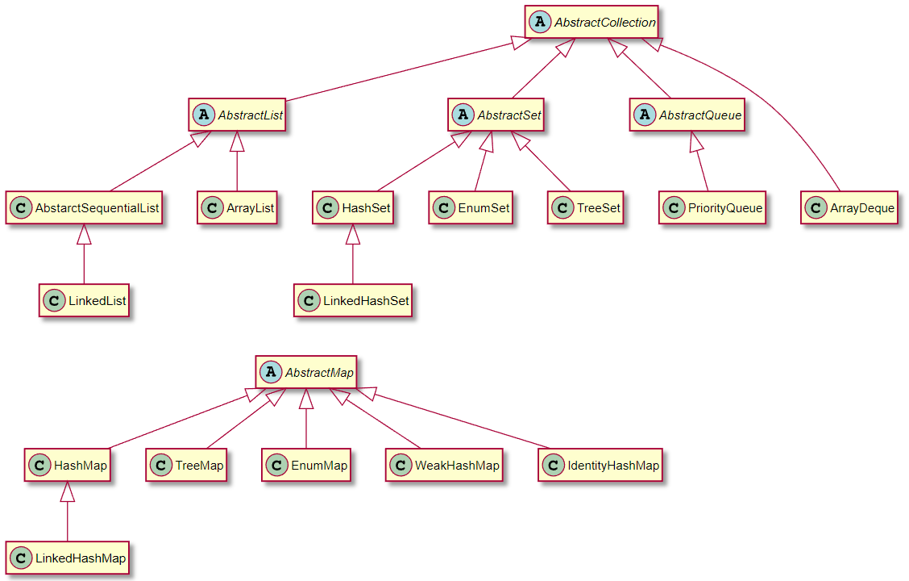

# Collections Framework

Ключевые компоненты
Коллекции являются весьма важными элементами при программировании. Они состоят из определенных частей:

- Интерфейсов. За счет них уже имеющиеся коллекции предусматривают возможность обеспечения типа данных абстрактного вида для представления корневого интерфейса фреймворка. Он находится на самой вершине иерархии составляющих компонентов коллекций. Включает в себя самые важные методы, задействованные при написании утилит: clear, add, size, iterator, remove. При нормальных условиях они реализовываются в каждой коллекции.
- Реализации. Для коллекций в Java предусмотрено множество реализаций. Их можно применять для создания новых классов. Через множество базовых коллекций удается решать немало задач. В Java5 применяются потокобезопасные коллекции. Они дают возможность корректировать их структуру по компонентам в момент осуществления итерации.
- Алгоритмов. Это – полезные методы, которые позволяют решать множество элементарных задач. Отдельное внимание стоит уделить сортировке, поиску, перетасовке и им подобным.

## Иерархия каркаса коллекции
На вершине иерархии в Java Collection Framework располагаются 2 интерфейса: Collection и Map. Эти интерфейсы разделяют все коллекции, входящие во фреймворк на две части по типу хранения данных: простые последовательные наборы элементов и наборы пар «ключ — значение» (словари).

### Особенности коллекций

## Интерфейсы коллекций

### Иерархия интерфейсов коллекций

|    Интерфейс    |                                   Описание                                                        |
|-----------------|---------------------------------------------------------------------------------------------------|
|  Itarable       |  Реализация данного интерфейса позволяет объекту использоваться в цикле “for-each”                | 
|  Collection     |  Корневой интерфейс в иерархии коллекций                                                          | 
|  List           |  Упорядоченная коллекция (также известная как последовательность)                                 | 
|  Set            |  Коллекция (набор/множество), которая не содержит повторяющихся элементов                         | 
|  SortedSet      |  Интерфейс Set, который дополнительно обеспечивает упорядочение по его элементам                  | 
|  NavigableSet   |  Интерфейс SortedSet расширенный с помощью методов навигации, обеспечивающих поиск ближайших      | 
|                 |  совпадений искомых элементов                                                                     | 
|  Queue          |  Очередь, предназначенна для хранения элементов перед обработкой                                  | 
|  Deque          |  Линейная коллекция, которая поддерживает вставку и удаление элементов на обоих концах            | 
|  Map            |  Отображение. Объект, который сопоставляет ключи со значениями                                    | 
|  SortedMap      |  Отображение, которое дополнительно обеспечивает упорядочивание по ключам                         | 
|  NavigableMap   |  Интерфейс SortedMap расширенный с помощью методов навигации, обеспечивающих поиск ближайших      | 
|                 |  совпадений искомых элементов                                                                     | 
|  Iterator       |  Итератор по коллекции                                                                            | 
|  ListIterator   |  Итератор для списков, который позволяет программисту перемещаться по списку в любом направлении, | 
|                 |  изменять список во время итерации и получать текущее положение итератора в списке                | 
|  RandomAccess   |  Маркерный интерфейс, используемый реализациями списков для указания на то, что они поддерживают  | 
|                 |  быстрый (обычно постоянный по времени) произвольный доступ                                       | 

#### Общие интерфейсы

|    Интерфейс    |                                   Описание                                                        |
|-----------------|---------------------------------------------------------------------------------------------------|
|  Cloneable      |  Позволяет классам, реализующим интерфейс, сделать копию экземпляра класса                        | 
|  Serializable   |  Интерфейс позволяет классу быть сериализованным, это означает что объект класса может быть       | 
|                 |  преобразован в последовательность бит или байт для передачи по сети                              | 

## Классы коллекций

### Иерархия классов (без потокобезопасных)

Таблица с описанием

| Класс коллекции |                                   Описание                                                        |
|-----------------|---------------------------------------------------------------------------------------------------|	
|ArrayList        | Динамический списочный массив                                                                     |
|LinkedList |	Упорядоченный список, допускающий эффективную вставку и удаление в любой позиции |
|ArrayDeque |	Двунаправленная очередь в виде циклического массива |
| HashSet |	Неупорядоченное хэш множество, исключающее дубликаты |
| LinkedHashSet |	Хэш множество с порядком ввода элементов |
| TreeSet |	Отсортированное множество |
| EnumSet |	Множество значений перечислимого типа |
| PriorityQueue |	Очередь позволяющая эффективно удалять наименьший элемент |
| HashMap |	Отображение. Структура данных для хранения связанных вместе пар “ключ-значение” |
| TreeMap |	Отображение с отсортированными ключами |
| EnumMap |	Отображение с ключами перечислимого типа |
| WeakHashMap |	Отображение со значениями, которые могут удаляться системой сборки “мусора”, если не используются |
| LinkedHashMap |	Отображение с порядком добавления элементов |
| IdentityHashMap |	Отображение с ключами, сравниваемыми с помощью ==, а не метода equals() |

Классы, которые реализуют интерфейсы коллекций обычно имеют имена в форме <способ реализации><интерфейс>.

Наиболее общие реализации сведены в следующей таблице:

|Interface  |	Hash Table |	Resizable Array |	Balanced Tree |	Linked List   |	Hash Table + Linked List       |
|-----------|--------------|--------------------|-----------------|---------------|--------------------------------|
|Set |	HashSet |		TreeSet |		LinkedHashSet |
|List |		ArrayList |		LinkedList |
| Deque |		ArrayDeque |		LinkedList	 |
|Map |	HashMap |		TreeMap |		LinkedHashMap |

### Свойства коллекций

|Interface  |	Hash Table |	Resizable Array |	Balanced Tree |	Linked List                                     |	
|-----------|--------------|--------------------|-----------------|-------------------------------------------------|
|Коллекция  |	Порядок |	Сортировка	| Допускает NULL |
|ArrayList |	По индексу |	Нет |	Да
|Vector |	По индексу |	Нет	|  |
|LinkedList|	По индексу |	Нет	| Да |
|ArrayDeque|	По индексу |	Нет	| Нет |
|PriorityQueue|	Отсортирован |	PIPO |	Нет |
|HashSet |	Нет |	Нет	| Да |
|LinkedHashSet |	В порядке добавления |	Нет |	Да |
|TreeSet |	Отсортирован |	В естественном или индивидуальном порядке	| Нет |
|EnumSet |	Нет |	Нет |	Нет |
|HashMap |	Нет |	Нет |	Да |
|TreeMap | 	Отсортировано |	В естественном или индивидуальном порядке |	Ключ - нет, значение - да |
|WeakHashMap |	Нет |	Нет |	Да |
|LinkedHashMap |	В порядке добавления или последнего доступа	|Нет	|  |
|Hashtable |	Нет |	Нет |	Нет |

### Временные характеристики

|    Среднее    |    Индекс   | 	Поиск    |	 Вставка   |	Удаление    |
|---------------|-------------|--------------|-------------|----------------|
|ArrayList  |	O(1)	| O(n) |	O(n)	| O(n) |
|Vector     	| O(1) |	O(n) |	O(n) |	O(n) |
|LinkedList     |	O(n)	| O(n)	| O(1)	 | O(1) |
|Hashtable	   | n/a |	O(1) |	O(1) |	O(1) |
|HashMap	   | n/a |	O(1) |	O(1) |	O(1) |
|LinkedHashMap |	n/a	| O(1) |	O(1)	 | O(1) |
|TreeMap	| n/a |	O(log(n))	 | O(log(n)) |	O(log(n)) |
|HashSet	| n/a |	O(1) |	O(1) |	O(1) |
|LinkedHashSet | n/a |	O(1) |	O(1) |	O(1) |
|TreeSet	| n/a	 | O(log(n)) |	O(log(n)) |	O(log(n)) |

|    Худшее     |    Индекс   | 	Поиск    |	 Вставка   |	Удаление    |
|---------------|-------------|--------------|-------------|----------------|
|ArrayList      |	O(1) |	O(n) |	O(n)	| O(n) |
|Vector         |	O(1)    |	O(n) |	O(n)	| O(n) |
|LinkedList	    | O(n) |	O(n) |	O(1) |	O(1) |
|Hashtable	    |n/a |	O(n) |	O(n) |	O(n) |
||HashMap	    |n/a |	O(n) |	O(n) |	O(n) |
|LinkedHashMap  |	n/a	| O(n) |	O(n) |	O(n) |
|TreeMap	    |n/a |	O(log(n)) |	O(log(n))	 | O(log(n)) |
|HashSet	    |n/a |	O(n)  |	O(n) |	O(n) |
|LinkedHashSet  |	n/a	| O(n)	 | O(n)	O(n) |
|TreeSet	    |n/a	 |O(log(n))	 | O(log(n)) | O(log(n)) |

O(1) - операция происходит в одно действие
O(n) - операция происходит в n действий, где n – это индекс элемента, который нам нужен. Это линейная зависимость
O(log(n))  - логарифмическая сложность означает, что время увеличивается линейно, когда n растет экспоненциально. Таким образом, если для вычисления 10 элементов требуется    1 секунда, то для вычисления 100 элементов потребуется 2 секунды, и так далее.

## Содержание
1. [collections](https://github.com/alexmnv03/java-core/tree/develop/collection-framework/src/main/java/collectionsframework/collections)
   - [Iterator](https://github.com/alexmnv03/java-core/tree/develop/collection-framework/src/main/java/collectionsframework/collections/Iterator)
   - [list](https://github.com/alexmnv03/java-core/tree/develop/collection-framework/src/main/java/collectionsframework/collections/list)
       - [arraylist](https://github.com/alexmnv03/java-core/tree/develop/collection-framework/src/main/java/collectionsframework/collections/list/arraylist)
       - [linkedlist](https://github.com/alexmnv03/java-core/tree/develop/collection-framework/src/main/java/collectionsframework/collections/list/linkedlist)
   - [listIterator](https://github.com/alexmnv03/java-core/tree/develop/collection-framework/src/main/java/collectionsframework/collections/listIterator)
   - [queues](https://github.com/alexmnv03/java-core/tree/develop/collection-framework/src/main/java/collectionsframework/collections/queues)
     - [ArrayDeque](https://github.com/alexmnv03/java-core/tree/develop/collection-framework/src/main/java/collectionsframework/collections/queues/deque/ArrayDeque)
     - [priorityqueue](https://github.com/alexmnv03/java-core/tree/develop/collection-framework/src/main/java/collectionsframework/collections/queues/queue/priorityqueue)
   - [set](https://github.com/alexmnv03/java-core/tree/develop/collection-framework/src/main/java/collectionsframework/collections/set)
     - [enumset](https://github.com/alexmnv03/java-core/tree/develop/collection-framework/src/main/java/collectionsframework/collections/set/enumset)
     - [hashset](https://github.com/alexmnv03/java-core/tree/develop/collection-framework/src/main/java/collectionsframework/collections/set/hashset)
     - [linkedhashset](https://github.com/alexmnv03/java-core/tree/develop/collection-framework/src/main/java/collectionsframework/collections/set/linkedhashset)
     - [treeset](https://github.com/alexmnv03/java-core/tree/develop/collection-framework/src/main/java/collectionsframework/collections/set/treeset)
2. [map](https://github.com/alexmnv03/java-core/tree/develop/collection-framework/src/main/java/collectionsframework/map)
   - [EnumMap](https://github.com/alexmnv03/java-core/tree/develop/collection-framework/src/main/java/collectionsframework/map/EnumMap)
   - [HashMap](https://github.com/alexmnv03/java-core/tree/develop/collection-framework/src/main/java/collectionsframework/map/HashMap)
   - [Hashtable](https://github.com/alexmnv03/java-core/tree/develop/collection-framework/src/main/java/collectionsframework/map/Hashtable)
   - [IdentityHashMap](https://github.com/alexmnv03/java-core/tree/develop/collection-framework/src/main/java/collectionsframework/map/IdentityHashMap)
   - [LinkedHashMap](https://github.com/alexmnv03/java-core/tree/develop/collection-framework/src/main/java/collectionsframework/map/LinkedHashMap)
   - [TreeMap](https://github.com/alexmnv03/java-core/tree/develop/collection-framework/src/main/java/collectionsframework/map/TreeMap)
   - [WeakHashMap](https://github.com/alexmnv03/java-core/tree/develop/collection-framework/src/main/java/collectionsframework/map/WeakHashMap)

